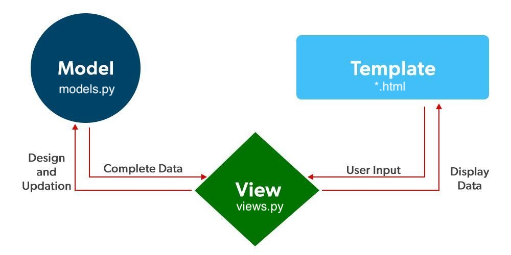

# Веб-разработка на Django
## Мастер-класс

---

## ❓ Что такое Django?

**Официально:** "Высокоуровневый Python веб-фреймворк, который поощряет быструю разработку и чистый, прагматичный дизайн"

**Неофициально:** "Веб-фреймворк для перфекционистов с дедлайнами"

---

### ❓ Почему именно Django?
"Батарейки в комплекте" – Django поставляется "из коробки" с решениями для 90% типовых задач

---

### Архитектура Model-View-Template



---

## Как это работает вместе

1. Пользователь заходит на URL.
2. Django находит нужный View через urls.py.
3. View обращается к Model за данными.
4. Model (через ORM) делает запрос к Базе Данных.
5. View получает данные и передает их в Template.
6. Template генерирует HTML.
7. Пользователь видит готовую страницу.

---

## ❓ Что мы изучим сегодня
<div style="text-align: left;">

- ✅ Работу с базой данных

- ✅ Модели Django

- ✅ Админ-панель Django

- ✅ Представления (views)

- ✅ Систему шаблонов

- ✅ URL-маршрутизацию
</div>

---

## 🐍 Установка 📎 [uv](https://docs.astral.sh/uv) и Python
macOS/Linux
```bash
curl -LsSf https://astral.sh/uv/install.sh | sh
# или
wget -qO- https://astral.sh/uv/install.sh | sh
```
Windows
```bash
powershell -ExecutionPolicy ByPass -c "irm https://astral.sh/uv/install.ps1 | iex"
```

```bash
uv python install
```
---

### Настройка виртуального окружения
```bash
uv venv
uv pip install django
uv run django-admin startproject todo_list .
uv run manage.py startapp tasks
```

---

## 🚀 Запуск проекта
```bash
uv run manage.py runserver
```

📎 [Полный список команд manage.py](https://docs.djangoproject.com/en/stable/ref/django-admin/)

---

## 🪾 Структура проекта

```
.
├── manage.py           # Скрипт для выполнения административных задач
├── tasks
│   ├── __init__.py
│   ├── admin.py        # Управление админкой
│   ├── apps.py         # Конфиг приложения
│   ├── migrations      # Миграции базы данных
│   │   └── __init__.py
│   ├── models.py       # Модели Django
│   ├── tests.py        # Тесты
│   ├── templates       # Шаблоны HTML
    ├── urls.py         # URL-маршруты
│   └── views.py        # Посредник между моделями и html-страницами
└── todo_list
    ├── __init__.py
    ├── asgi.py         # Точка входа для запуска асинхронного интерфейса приложения
    ├── settings.py     # Настройки проекта
    ├── urls.py         # Центральная точка URL-маршрутизации
    └── wsgi.py         # Точка входа для запуска синхронного интерфейса приложения
```

---

### ⚙ Настройки проекта (settings.py)

📎 [Полный список настроек](https://docs.djangoproject.com/en/stable/ref/settings/)

<table style="font-size: 0.1em; width: 100%;">
  <tr>
    <td>BASE_DIR</td>
    <td>Корневая директория</td>
  </tr>
  <tr>
    <td>INSTALLED_APPS</td>
    <td>Компоненты проекта</td>
  </tr>
  <tr>
    <td>TEMPLATES</td>
    <td>Конфиг системы шаблонов</td>
  </tr>
  <tr>
    <td>DATABASES</td>
    <td>Настройки БД</td>
  </tr>
</table>

---

Добавим наше приложение в `INSTALLED_APPS`
```python
INSTALLED_APPS = [
    'django.contrib.admin',
    'django.contrib.auth',
    'django.contrib.contenttypes',
    'django.contrib.sessions',
    'django.contrib.messages',
    'django.contrib.staticfiles',
    'tasks',
]
```

---

# Модели Django
📎 [Документация по моделям](https://docs.djangoproject.com/en/stable/topics/db/models/)
```python
class Task(models.Model):
    title = models.CharField("Название", max_length=255, unique=True)
    description = models.TextField("Описание", blank=True)
    completed = models.BooleanField("Выполнено", default=False)
    created_at = models.DateTimeField("Дата создания", auto_now_add=True)

    class Meta:
        verbose_name = "Задача"
        verbose_name_plural = "Задачи"
        ordering = ['-created_at']

    def __str__(self):
        return self.title

    def get_absolute_url(self):
        return reverse("task_detail", kwargs={"pk": self.pk})
```
---

# Миграции
Создаём файл миграции
```bash
uv run manage.py makemigrations
```

Применяем миграцию к БД
```bash
uv run manage.py migrate
```

---

### Админ-панель
Создадим суперпользователя
```bash
uv run manage.py createsuperuser
```
Зарегистрируем модель
```python
from django.contrib import admin

from .models import Task

admin.site.register(Task)
```
http://127.0.0.1:8000/admin

---

# Представления (views)
```python
from django.shortcuts import render

from .models import Task


def task_list(request):
    tasks = Task.objects.all()
    return render(request, 'task_list.html', {'tasks': tasks})

def task_detail(request, pk):
    task = Task.objects.get(pk=pk)
    return render(request, 'task_detail.html', {'task': task})
```

---

### Шаблоны
```html
<!DOCTYPE html>
<head><title>Задачи</title></head>
<body>
    <h1>Задачи</h1>
    <p class="meta">Всего: {{ tasks|length }}</p>
    
        <ul>
            
                <li>
                    <div>
                        <a href="">{{ task.title }}</a>
                        <div class="meta">Создано: {{ task.created_at|date:"Y-m-d H:i" }}</div>
                    </div>
                    <span class="badge donetodo">
                        ВыполненоВ работе
                    </span>
                </li>
            
        </ul>
    
        <p class="empty">Список задач пуст.</p>
    
</body>
</html>
```

---

### Шаблоны
```html
<!DOCTYPE html>
<head><title><title>{{ task.title }}</title></title></head>
<body>
    <div class="crumbs"><a href="">← Назад к списку</a></div>
    <div class="card">
        <h1>{{ task.title }}</h1>
        <div class="meta">
            Статус:
            <span class="badge donetodo">
                ВыполненоВ работе
            </span>
            · Создано: {{ task.created_at|date:"Y-m-d H:i" }}
        </div>
        
            <div class="desc">{{ task.description }}</div>
        
            <div class="desc" style="color:#6b7280;font-style:italic;">Описание отсутствует.</div>
        
    </div>
</body>
</html>
```

---

### URL-маршрутизация
Последний шаг: "прикручиваем" наши View к URL

Основной urls.py
```python
from django.contrib import admin
from django.urls import include, path

urlpatterns = [
    path('admin/', admin.site.urls),
    path('', include('tasks.urls')),
]
```
[📎 Документация](https://docs.djangoproject.com/en/5.2/topics/http/urls)

---
### URL-маршрутизация
Последний шаг: "прикручиваем" наши View к URL

tasks/urls.py
```python
from django.urls import path

from . import views

urlpatterns = [
    path('', views.task_list, name='task_list'),
    path('<int:pk>/', views.task_detail, name='task_detail'),
]
```
[📎 Документация](https://docs.djangoproject.com/en/5.2/topics/http/urls)

---

# Код проекта

[github.com/vyhuholl/todo_list](https://github.com/vyhuholl/todo_list)

---

# 📚 Полезные ресурсы
<div style="text-align: left;">

- 📎 [Официальная документация](https://docs.djangoproject.com/en/5.2)

- 📎 [Туториал](https://docs.djangoproject.com/en/5.2/intro/tutorial01)

- 📎 [Django Community](https://www.djangoproject.com/community)

- 📎 [MDN Web Docs (Django)](https://developer.mozilla.org/ru/docs/Learn/Server-side/Django)
</div>

---

# 📬 Остаёмся на связи!
<div class="columns">
<div>


[@DebugSkills](https://t.me/DebugSkills)

</div>
<div>


[@IT_Chuyana](https://t.me/IT_Chuyana)

</div>

<div>


[@olgap981](https://t.me/olgap981)

</div>
</div>

<style>
.columns {
  display: flex;
  justify-content: center;
  gap: 40px;
  margin-top: 40px;
}
.columns > div {
  text-align: center;
  font-size: 30px;
}
</style>